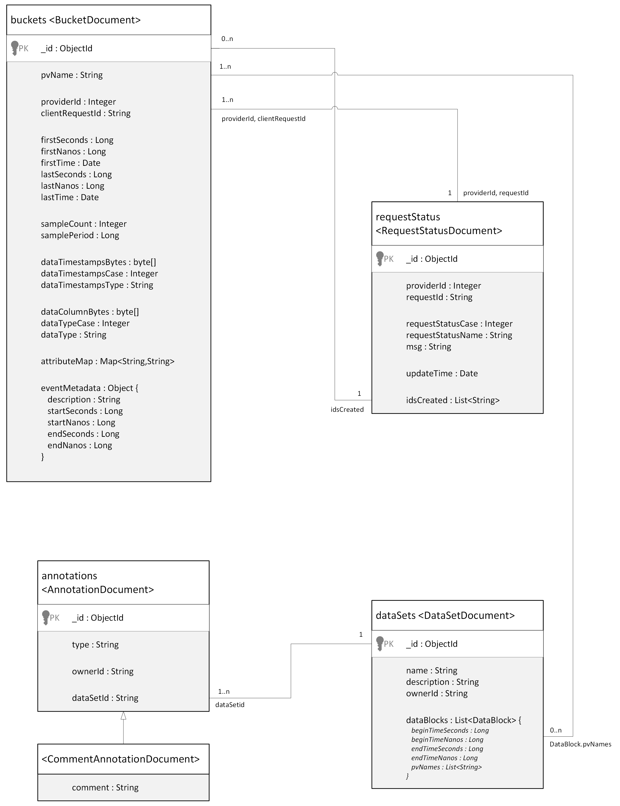

## Section 1. Data Platform Overview


### motivation

The Data Platform provides tools for managing the data captured in an experimental research facility, such as a particle accelerator. The data are used within control systems and analytics applications, and facilitate the creation of machine learning models for those applications.

The Data Platform is agnostic to the source and acquisition of the data. A project goal is to manage data captured from the [EPICS "Experimental Physics and Industrial Control System"](https://epics-controls.org/), however, use of EPICS is not required. The Data Platform APIs are generic and can be used from essentially all programming languages and any type of application.


### requirements and objectives


* Provide an API for ingestion of heterogeneous data including scalar values, arrays, structures, and images.
* Handle the data rates expected for an experimental research facility such as a particle accelerator.  A baseline performance requirement is to handle 4,000 scalar data sources sampled at 1 KHz, or 4 million samples per second.
* Provide an API for retrieval of ingested data.
* Provide an API for exploring metadata for data sources available in the archive.
* Provide mechanisms for adding post-ingestion annotations to the archive, and performing queries over those annotations.


### data platform elements

The Data Platform includes two primary technical components, including an API utilizing the gRPC framework, and a suite of services built using the Java programming language.  The project also includes utilities for deploying and managing those components.  A JavaScript web application for exploring the data archive and working with data is under development.  Each element is described in more detail below.


#### gRPC API

The Data Platform API is built upon the [gRPC open-source high-performance remote procedure call (RPC) framework](https://grpc.io/). As described on [Wikipedia](https://en.wikipedia.org/wiki/GRPC), "this framework was originally developed by Google for use in connecting microservices. It uses HTTP/2 for transport, protocol buffers as the interface description languages, and provides features such as authentication and bidirectional streaming. It generates cross-platform client and server bindings for many languages."

We chose to use the gRPC framework for the Data Platform API because it can meet our performance requirements for data ingestion, and bindings are provided for virtually any programming language.

The API definition is managed separately from the service implementations so that it can be utilized for building client applications that are independent of other Data Platform technology.  The Data Platform gRPC API is described in more detail in section 2.


#### service implementations

The Data Platform Services are implemented as Java server applications.  There are three independent server applications, providing ingestion, query, and annotation services, respectively.  The [MongoDB document-oriented database management system](https://www.mongodb.com/) is used by the services for persistence.  Section 3 provides more detail about the Java service implementations and the frameworks used to build them.


#### web application

The Data Platform Web Application is under development using the [JavaScript React library](https://react.dev/).  It will provide a user interface for navigating archive metadata and time-series data, viewing and creating annotations, and other tools for visualizing and exporting data.


#### installation and deployment support tools

A set of utilities is provided to help manage the Data Platform ecosystem.  There are scripts for managing infrastructure services including MongoDB and the Envoy proxy (used for deploying the web application), and a set of simple process-management utilities for managing the Data Platform server and benchmark applications.


### status and milestones


#### "datastore" prototype (2022)

A prototype implementation of the Data Platform services was built focusing on the creation of a general API supporting ingestion and query of heterogeneous data types including scalar, array / table, structure, and image. Service implementations were created using Java for both the Ingestion and Query Services, as well as libraries for building client applications. The prototype technology stack included both [InfluxDB](https://www.influxdata.com/) (for time series data) and MongoDB (for metadata). This prototype successfully demonstrated the use of gRPC APIs for ingestion and retrieval of heterogeneous, but did not meet the baseline performance requirements.


#### datastore web application prototype (2022)

The datastore prototype included development of a web application using JavaScript React and Tailwind libraries.  The prototype provided simple user interfaces for navigating metadata, as well as querying and displaying time-series data.  It demonstrated calling gRPC APIs from a browser-based application using the [gRPC Web](https://github.com/grpc/grpc-web/) JavaScript implementation of gRPC for browser clients.


#### technology performance benchmarking (September 2023)

Performance benchmark applications were developed and utilized to evaluate candidate technologies for use in the Data Platform implementation in light of the project performance goal stated above. Benchmarks focused on gRPC for API communication; InfluxDB, MongoDB and MariaDB for database storage; and writing JSON and HDF5 files to disk. The benchmark results showed that it was likely we could build service implementations meeting our performance requirements by using gRPC for communication and [MongoDB for storing "buckets" of time series data](https://www.mongodb.com/blog/post/building-with-patterns-the-bucket-pattern).


#### Data Platform v1.0 (November 2023)

Version 1.0 of the Data Platform includes an initial Java implementation of the Ingestion Service providing a gRPC API and using MongoDB for storing time-series data. The initial ingestion service implementation focuses only on scalar data and with timestamps specified using the "sampling clock" mechanism with start time and sample period (described further in section 2).  It is accompanied by a performance benchmark application that is used at each stage of development to measure ingestion performance relative to the project goal. The initial implementation exceeds our goal by a comfortable margin, but this will continue to be a focus as the project evolves.  Section 2 provides more information about the ingestion API.


#### v1.1 (January 2024)

Version 1.1 includes a Java implementation of the Query Service gRPC API, using the MongoDB database managed by the ingestion service to fulfill client query requests.  A variety of API RPC methods for querying time-series data are provided to support the development of clients with varying performance requirements, ranging from streaming methods that return bucketed result data down to simple single response methods that return tabular data.  See section 2 for a detailed description of the query API.


#### v1.2 (February 2024)

Version 1.2 saw changes to the "proto" files defining the gRPC API for the Data Platform to be more consistent and conventional, with corresponding changes to the Java service implementations.


#### v1.3 (April 2024)

Version 1.3 provides an initial implementation of the annotation service for adding annotations to archived data and performing queries against those annotations.  The primary focus for the initial annotation service implementation was on the data model for associating annotations with data in the archive.  The only type of annotation currently supported is a simple user comment, but we will be adding many other types of annotations using the same underlying data model.  See section 2 for more details about the annotation data model.


#### v1.4 (July 2024)

Version 1.4 added Ingestion and Query Service support for all data types defined in the Data Platform API including scalars, multi-dimensional arrays, structures, and images. Support is also added to both services for ingesting and querying data with an explicit list of data timestamps to complement the existing support for specifying data timestamps using a SamplingClock (with start time, sample period, and number of samples). Both features utilize serialization of the protobuf DataColumn and DataTimestamps API objects as byte array fields of the MongoDB BucketDocument. This change improves ingestion performance significantly, while also reducing the MongoDB storage footprint and simplifying the codebase.


### todo and road map


#### v1.5 planned features (July / August / September 2024)

* Run more extensive load testing benchmarks.
* Add support for EPICS status/alarm etc
* Develop API and implement export service RPC methods.
* Add support for additional annotation types, including linked and derived data sets, and post-ingestion calculations.
* Implement API for checking status of asynchronous ingestion requests.
* Implement API for provider registration.
* Build simple data generator for demo and web application development.


#### features planned for future releases

* Implement mechanism for ingestion data validation.
* Add support for authentication and authorization of query and annotation services.
* Investigate MongoDB database partitioning (sharding) and connection pooling.
* Experiment with horizontal scaling alternatives.
* Experiment with streaming architecture (e.g., Apache Kafka)


### project organization

The Data Platform project is organized using the following github repositories:


#### dp-grpc

The [dp-grpc repo](https://github.com/osprey-dcs/dp-grpc) contains the Data Platform API definition.  It includes documentation for the Platform's data and service models, and a description of the gRPC "proto" files containing the API definition, which is provided in Section 2 of this document.


#### dp-service

The [dp-service repo](https://github.com/osprey-dcs/dp-service) contains the Java code for implementations of the Data Platform services, including the shared frameworks used to build them.  It includes documentation about those frameworks and the underlying MongoDB database schema utilized by the services, which is provided by Section 3 of this document.


#### dp-web-app

The [dp-web-app repo](https://github.com/osprey-dcs/dp-web-app) contains the JavaScript code for the Data Platform Web Application, with documentation about the approach.


#### dp-support

The [dp-support repo](https://github.com/osprey-dcs/dp-support) contains the scripts and utilities for managing the components of the Data Platform ecosystem.  It includes documentation for using those tools.


#### data-platform

The [data-platform repo](https://github.com/osprey-dcs/data-platform) is the primary repo for the Data Platform project.  It contains documentation about the approach with links to the other repos, provided in Section 1 of this document.  It also includes a Quick Start guide for running the Data Platform ecosystem from the installer.


#### dp-benchmark

The [dp-benchmark repo](https://github.com/osprey-dcs/dp-benchmark) is not currently active, but contains code developed for evaluating the performance of some candidate technologies considered for use in the Data Platform service technology stack.  It includes an overview of the benchmark process with a summary of results.


## Section 2: Data Platform API

This section provides additional background for the gRPC framework used to implement the Data Platform API, the data and service models reflected in the API, and mapping of the API elements to the gRPC "proto" files that define the API.


### 2.1 gRPC background

[gRPC is a framework](https://grpc.io/docs/what-is-grpc/introduction/) that allows a client application to call a method on a server application.  Defining an API with gRPC consists of identifying the services to be provided by the application, specifying the methods that can be called remotely for each service along with the method parameters and return types.

Underlying the gRPC framework is another Google-developed technology, [Protocol Buffers, which is an open source mechanism for serializing structured data](https://protobuf.dev/overview).  gRPC uses Protocol Buffers as both the Interface Definition Language (IDL), and as the underlying message interchange format.

The gRPC API is defined using "proto" files (a text file with a ".proto" extension).  Proto files contain definitions for services, service methods, and the data types used by those methods.  Data types are called "messages", and each message specifies a series of name-value pairs called "fields".  The definition of one message can be nested within another, limiting the scope of the nested data type to the message it is nested within.

See the links above for some simple examples of services, methods, and messages.

### 2.2 Data Platform gRPC API proto files

Currently, the Data Platform API defines three application services: ingestion, query, and annotation.  The methods and data types (messages) for each service are contained in individual "proto" files (e.g., "ingestion.proto", "query.proto", and "annotation.proto"), with some shared data types in "common.proto" that are included in the relevant service files via "import" statements.

### 2.3 Data Platform proto file conventions

#### ordering of elements

Within the Data Platform service proto files, elements are listed in the following order:

1. service method definitions
2. definition of request and response data types
3. definition of other shared data types

#### packaging of parameters for a method into a single "request" message

For all Data Platform service methods, parameters are bundled into a single "request" message data type, instead of listing multiple parameters to the method.

#### naming of request and response messages

The service-specific proto files each begin with a "service" definition block that defines the method interface for that service, including parameters and return types.  Where possible, the data types for the request and response use message names based on the corresponding method name.

A simple example is the Ingestion Service method "registerProvider()". The method request parameters are bundled in a message data structure called "RegisterProviderRequest". The method returns the response message type "RegisterProviderResponse".  So the method definition looks like this:

```
rpc registerProvider (RegisterProviderRequest) returns (RegisterProviderResponse);
```

A more complex example is the Ingestion Service RPC methods "ingestDataStream()" (bidirectional streaming data ingestion API) and "ingestData()" (unary data ingestion API). We want both methods to use the same request and response data types, so we use the common message types "IngestionRequest" and "IngestionResponse". This pattern is also used for time-series data queries defined in "query.proto".  The method definitions look like this:

```
rpc ingestData (IngestDataRequest) returns (IngestDataResponse);
rpc ingestDataStream (stream IngestDataRequest) returns (stream IngestDataResponse);
```

#### nesting of messages

Where possible, nesting is used to enclose simpler messages within the more complex messages that use them.  In cases where we want to share messages between multiple request or response messages, the definition of those messages appears after the request and response messages in the proto file.

#### determining successful method execution

A common pattern is used across all Data Platform service method responses to assist in determining whether an operation succeeded or failed.  All response messages use the gRPC "oneof" mechanism so that the message payload is either an "ExceptionalResult" message indicating that the operation failed, or a method-specific message containing the result of a successful operation.

The "ExceptionalResult" message is defined in "common.proto" with an enum indicating the status of the operation and a descriptive message.  The enum indicates operations that were rejected, encountered an error in processing, failed to return data, resources that were unavailable when requested, etc.

Here is an example of the use of this pattern in the "QueryDataResponse" message used to send the result of time-series data queries:

```
message QueryDataResponse {

  oneof result {
    ExceptionalResult exceptionalResult = 10;
    QueryData queryData = 11;
  }

  message QueryData {

    repeated DataBucket dataBuckets = 1;

    message DataBucket {
      // DataBucket field definitions...
    }
  }
}
```

### 2.4 Data Platform API data model

The purpose of this section is to introduce some of the elements of the Data Platform's data model.  These concepts will be used in subsequent descriptions of the various service APIs.

#### 2.4.1 process variables

The core element of the Data Platform is the "process variable" (PV).  In control theory, a process variable is the current measured value of a particular part of a process that is being monitored or controlled.  The primary purpose of the Data Platform Ingestion and Query Services is to store and retrieve PV measurements.  It is assumed that each PV for a particular facility is uniquely named.  E.g., "S01:GCC01" might identify the first vacuum cold cathode gauge in sector one in the storage ring for some accelerator facility.

#### 2.4.2 data vectors

The Data Platform Ingestion and Query Service APIs for handling data work with vectors of PV measurements.  In "common.proto", this is reflected in the message data type "DataColumn", which includes a PV name and list of measurements.

#### 2.4.3 handling heterogeneous data

One requirement for the Data Platform API is to provide a general mechanism for handling heterogeneous data types for PV measurements including simple scalar values, as well as multi-dimensional arrays, structures, and images.   This is accomplished by the "DataValue" message data type in "common.proto",  which uses the "oneof" mechanism to support a number of different data types for the values in a data vector (DataColumn).

#### 2.4.4 timestamps

Time is represented in the Data Platform API using the "Timestamp" message defined in "common.proto".  It contains two components for the number of seconds since the epoch, and nanoseconds.  As a convenience, the message "TimestampList" is used to send a list of timestamps.

#### 2.4.5 ingestion data frame

The message "IngestionDataFrame", defined in "ingestion.proto", is the primary unit of ingestion in the Data Platform API.  It contains the set of data to be ingested, using a list of "DataColumn" PV data vectors (described above).  It uses the message "DataTimestamps", defined in "common.proto", to specify the timestamps for the data values in those vectors.

"DataTimestamps" provides two mechanisms for specifying the timestamps for the data values.

A "TimestampList" (described above) may be used to send an explicit list of "Timestamp" objects.  It is assumed that each PV data vector "DataColumn" is the same size as the list of timestamps, so that there is a data value specified for each corresponding time value.

A second alternative is to use the "SamplingClock" message, defined in "common.proto".  It uses three fields to specify the data timestamps, with a start time "Timestamp", the sample period in nanoseconds, and an integer count of the number of samples.  The size of each data vector "DataColumn" in the "IngestionDataFrame" is expected to match the sample count.


#### 2.4.6 bucketed time-series data

We use the ["bucket pattern"](https://www.mongodb.com/blog/post/building-with-patterns-the-bucket-pattern) as an optimization for handling time-series data in the Data Platform API for query results, as well as for storing a vector of PV measurement values in MongoDB.  A "bucket" is a record that contains all the measurement values for a single PV for a specified time range.

This allows a list of values to be stored as a single unit in the database and returned in query results, as opposed to storing and returning individual data values and requiring that each record contains both a timestamp and data value (which effectively triples the record size for scalar data).  This leads to a more compact database, smaller gRPC messages to send query results, and improved overall performance.

A simple example of the bucket pattern follows (a slightly modified version of an example taken from the link above), demonstrating bucketing of temperature sensor data.  The first snippet shows three measurements, with one record per measurement:

```
{
   sensor_id: 12345,
   timestamp: ISODate("2019-01-31T10:00:00.000Z"),
   temperature: 40
}

{
   sensor_id: 12345,
   timestamp: ISODate("2019-01-31T10:01:00.000Z"),
   temperature: 40
}

{
   sensor_id: 12345,
   timestamp: ISODate("2019-01-31T10:02:00.000Z"),
   temperature: 41
}
```

With bucketing, we save the overhead of the sensor_id and timestamp in each record:
```
{
    sensor_id: 12345,
    start_date: ISODate("2019-01-31T10:00:00.000Z"),
    sample_period_nanos: 1_000_000_000,
    count: 3
    measurements: [ 40, 40, 41 ]
}
```

Bucketing is used to send the results of time-series data queries.  The message "QueryDataResponse" in "query.proto" contains the query result in "QueryData", which contains a list of "DataBucket" messages.  Each "DataBucket" contains a vector of data in a "DataColumn" message for a single PV, along with time expressed using "DataTimestamps" (described above), with either an explicit list of timestamps for the bucket data values, or a SamplingClock with start time and sample period.


#### 2.4.7 datasets

When designing the Data Platform's Annotation Service, we found we needed a mechanism for specifying a collection of data in the archive as the subject of an annotation.  We decided to add the notion of a "dataset", consisting of a list of "data blocks", where each "data block" specifies a list of PV names and a time range.

If you think of the entire data archive as a giant spreadsheet, with a column for each PV name and a row for each measurement timestamp, a "data block" specifies some region within that spreadsheet, and a "dataset" contains a collection of those regions.  This is illustrated in the figure below.


"annotation.proto" defines the messages "DataSet" and "DataBlock" for use as the data model for creating annotations, where a "DataSet" includes a description and a list of "DataBlock" messages, and each "DataBlock" includes begin and end Timestamp messages (described above), and a list of PV names.

#### 2.4.8 annotations

An annotation allows clients to annotate the data archive with notes, data associations, and post-acquisition calculations.  The Data Platform Annotation Service currently supports only a "comment" annotation, but additional types of annotations will be added in future releases.

Given the definition of a "DataSet" described above, the message "CreateAnnotationRequest" in "annotation.proto" is used to create an annotation, by providing the id of the "DataSet" to be annotated (which allows us to add multiple annotations to the same DataSet), and the details for the particular type of annotation to be created.  In the case of a "CommentAnnotation", we simply specify the text of the comment.

For a link between related datasets, we might create a "LinkAnnotation" that specifies the id of the linked dataset and some text describing the relationship.

#### 2.4.9 ingestion metadata

The Ingestion Service API allows descriptive metadata to be attached to data sent to the archive.  Two types of metadata are supported, key/value attributes and event metadata.

The message "Attribute", defined in "common.proto", is a simple data structure that includes two strings, a key and a value.  The message "IngestDataRequest", in "ingestion.proto" includes an optional list of "Attribute" messages that can be used to tag the request's data as it is added to the archive.

The message "EventMetadata", also defined in "common.proto", allows incoming data to be associated with some event.  The "EventMetadata" message includes fields for the event description, with start and stop timestamps specifying the event start and stop time.

### 2.5 Data Platform API - ingestion service

"DpIngestionService" is a gRPC service defined in "ingestion.proto".  It includes methods for provider registration and data ingestion.

#### 2.5.1 provider registration

The Ingestion Service provider registration mechanism is not yet implemented.  It will assign unique identifiers to the infrastructure elements that will use the ingestion API to send data to the archive.

#### 2.5.2 data ingestion

The Ingestion Service provides a very streamlined API for ingesting data to the archive.  There are two methods for data ingestion:

```
rpc ingestData (IngestDataRequest) returns (IngestDataResponse);
rpc ingestDataStream (stream IngestDataRequest) returns (stream IngestDataResponse);
```

Both methods use the same request and response messages.  The method "ingestData()" sends a single "IngestDataRequest" and receives a single "IngestDataResponse" corresponding to the request.  "ingestDataStream()" is a bidirectional gRPC streaming method that allows the client to send a stream of "IngestDataRequest" messages and receive a stream of "IngestDataResponse" messages.  In both cases, the client uses the combination of provider id and request id to match incoming responses to outgoing requests.

##### ingestion data frame

As described above, the "IngestionDataFrame" is the primary unit of ingestion, containing a set of PV data vectors with the corresponding timestamp specification.

##### ingestion request

An "IngestDataRequest", defined in "ingestion.proto", includes an "IngestionDataFrame", optional metadata (list of key/value attributes or event metadata), a "Timestamp" indicating the time the request is sent, an id specifying the provider sending the data, and a mandatory client-generated request identifier, uniquely identifying the request for that provider.

##### ingestion response

The message "IngestDataResponse" in ingestion.proto contains one of two payloads, either an "ExceptionalResult" (described above) indicating an error or rejection, or an "AckResult", indicating the request was accepted and echoing back the dimensions of the request in confirmation.  The response also includes provider id and client request id for matching the response to the corresponding request, and a "Timestamp" indicating the time the message was sent.

The Ingestion Service is fully asynchronous, so the response does not indicate if a request is successfully handled, only whether the request is accepted or rejected.  A separate API for checking whether or not a request was handled successfully will be added in a future release.  It will support queries by provider id and/or request id to identify errors in handling ingestion requests.  For now, the "requestStatus" collection in MongoDB contains a document for each request indicating whether it succeeded or failed.  It is envisioned that a monitoring tool will use the request status API  to detect ingestion errors and send notification.

### 2.6 Data Platform API - query service

"DpQueryService" is a gRPC service defined in "query.proto".  It includes methods for querying both time-series data and metadata.

#### 2.6.1 time-series data query

The Query Service provides several methods for querying time-series data, offering different options for performance and packaging of results.
```
rpc queryData(QueryDataRequest) returns (QueryDataResponse);
rpc queryDataTable(QueryDataRequest) returns (QueryTableResponse);
rpc queryDataStream(QueryDataRequest) returns (stream QueryDataResponse);
rpc queryDataBidiStream(stream QueryDataRequest) returns (stream QueryDataResponse);
```

Each method accepts a "QueryDataRequest" message, described in more detail below, to specify the query parameters.  All the time-series data query methods return "QueryDataResponse" messages with the exception of queryDataTable(), which returns data in a tabular format via a "QueryTableResponse" message. Each of the time-series query methods and the corresponding request/response objects is discussed in more detail below.


##### queryData()

The "queryData()" method is a simple unary method with a single request and response.  The result of the query must fit in a single gRPC response message, or an error is generated.  The "QueryDataResponse" contains bucketed time-series data (described above).


##### queryDataTable()

Also a single request/response unary method, queryDataTable() differs in that the "QueryTableResponse" message contains a tabular result for use in clients such as the Data Platform Web Application that display data in tables.


##### queryDataStream()

Expected to be the best performing time-series data query method for retrieving a large amount of data, "queryDataStream()" accepts a single "QueryDataRequest" message and returns its result as a stream of "QueryDataResponse" messages, each of which contains bucketed time-series data.


##### queryDataBidiStream()

"queryDataBidiStream()" is a bidirectional streaming method.  This method is similar to queryDataStream(), but is used in clients that need explicit control of the response stream due to memory or performance considerations.

The client sends a single "QueryDataRequest" message, receiving a single "QueryDataResponse" with bucketed time-series data.  The client then requests the next response in the stream by sending a "QueryDataRequest" containing a "CursorOperation" method with type set to "CURSOR_OP_NEXT" until the result is exhausted and the stream is closed by the service.


##### QueryDataRequest

All time-series data query methods accept a "QueryDataRequest" message (defined in "query.proto").  The message contains one of two payloads, either a "QuerySpec" or a "CursorOperation".

A "QuerySpec" message payload specifies the parameters for a time-series data query and includes begin and end timestamps specifying the time range for the query, and a list of PV names whose data to retrieve for the specified time range.

A "CursorOperation" payload is a special case and applies only to the "queryDataBidiStream()" method.  It contains an enum value from "CursorOperationType" specifying the type of cursor operation to be executed.  Currently, the enum contains a single option "CURSOR_OP_NEXT" which requests the next message in the response stream.  We may add additional operations, e.g, "fetch the next N buckets".


##### QueryDataResponse

Except for "queryDataTable()", all time-series data query methods return "QueryDataResponse" messages.  A "QueryDataResponse" contains one of two message payloads, "ExceptionalResult" if an error is encountered or no data is found (described above) or "QueryData".

A "QueryData" message includes a list of "DataBucket" messages.  Each "DataBucket" contains a vector of data in a "DataColumn" message for a single PV, along with time expressed using "DataTimestamps" (described above), with either an explicit list of timestamps for the bucket data values, or a SamplingClock with start time and sample period.  The "DataBucket" also includes a list of key/value "Attribute" messages and/or "EventMetadata" message if specified on the ingestion request that created the bucket.


##### QueryTableResponse

The "queryDataTable()" time-series data query method returns its result via a "QueryTableResponse" message.  This is essentially a packaging of the bucketed time-series data managed by the archive into a tabular data structure for use in a client such as a web application.  A "QueryTableResponse" object contains one of two payloads, an "ExceptionalResult" if an error is encountered or no data is found (described above) or a "TableResult".

A "TableResult" message contains a list of PV column data vectors, one for each PV specified in the "QueryDataRequest".  It also contains a "DataTimestamps" message with a "TimestampList" of timestamps, one for each data row in the table.  The column data vectors are the same size as the list of timestamps, and are padded with empty values where a column doesn't contain a value at the specified timestamp.


#### 2.6.2 metadata query

The Data Platform Query Service includes a single method for querying the archive's metadata about the PVs available in the archive.

```
rpc queryMetadata(QueryMetadataRequest) returns (QueryMetadataResponse);
```

"queryMetadata()" is a single request/response unary method that accepts a "QueryMetadataRequest" and returns a "QueryMetadataResponse".


##### QueryMetadataRequest

The "QueryMetadataRequest" message is defined in query.proto, and contains one of two payloads, "PvNameList" or "PvNamePattern".  A "PvNameList" message specifies an explicit list of PVs to find metadata for.  A "PvNamePattern" specifies a regular expression pattern for matching against PV names available in the archive.


##### QueryMetadataResponse

The "QueryMetadataResponse" message contains the result of a metadata query and includes one of two payloads, either an "ExceptionalResult" if an error is encountered or no data is found (described above) or "MetadataResult".

A "MetadataResult" message contains a list of "PvInfo" messages, one for each PV specified for the query (either explicitly in the PV name list or by matching the supplied PV name pattern).  A "PvInfo" message contains metadata for an individual PV in the archive, including name, timestamps for the first and last PV measurement in the archive, and stats for the most recent bucket including bucket id, data type information, data timestamps details, and sample count/period.


### 2.7 Data Platform API - annotation service

"DpAnnotationService" is a gRPC service defined in "annotation.proto".  It includes methods for creating and querying "DataSets" (described above in section 2.4.7), and for creating and querying annotations.


#### 2.7.1 creating and querying datasets

The Data Platform Annotation Service uses datasets to identify the relevant data within the archive for a particular annotation.  The API includes a methods for creating and querying datasets.

```
rpc createDataSet(CreateDataSetRequest) returns (CreateDataSetResponse);
rpc queryDataSets(QueryDataSetsRequest) returns (QueryDataSetsResponse);
```

##### createDataSet()

This is a single request/response unary method for creating a dataset.  It accepts a "CreateDataSetRequest" message and returns a "CreateDataSetResponse".

##### CreateDataSetRequest

A "CreateDataSetRequest" message contains a "DataSet" message with details of the dataset to be created, e.g., its list of "DataBlock" messages.

##### CreateDataSetResponse

A "CreateDataSetResponse" message contains one of two payloads, an "ExceptionalResult" message if a rejection or error was encountered creating the dataset, or a "CreateDataSetResult".

A "CreateDataSetResult" message simply contains the unique identifier assigned to the new dataset if it was created successfully.

##### queryDataSets()

The "queryDataSets()" method is a single request/response method that searches for datasets in the archive that match the search criteria specified for the query.  It accepts a "QueryDataSetsRequest" message and returns a "QueryDataSetsResponse" message.

##### QueryDataSetsRequest

A "QueryDataSetsRequest" encapsulates the criteria for the query.  It contains a list of "QueryDataSetsCriterion" messages.

The "QueryDataSetsCriterion" message defines a number of different criteria message types that can be added to the criterion list, including an "OwnerCriterion" (specifying the owner id to match in the annotation query), "NameCriterion" (specifying text to match against dataset name), and "DescriptionCriterion" (specifying text to match against dataset description.

These query criteria can be used individually in the criteria list, or multiple criteria can be added to the list to specify a compound query.  E.g., adding an "OwnerCriterion" and "NameCriterion" to the list will match dataset names for the specified owner.

##### QueryDataSetsResponse

The "queryDataSets()" method returns a "QueryDataSetsResponse" message with the query results.  It contains one of two payloads, either an "ExceptionalResult" message if the query encountered an error or returned no data (described above), or an "DataSetsResult" message with the results if the query was successful.

The "DataSetsResult" message includes a list of "DataSet" messages, one for each dataset that matches the query's search criteria.

An "DataSet" message includes the following properties for the dataset: unique id, name, owner id, description, and a list of the "DataBlock" messages comprising the dataset.


#### 2.7.2 creating and querying annotations

The Data Platform Annotation Service provides two methods related to annotations.

```
rpc createAnnotation(CreateAnnotationRequest) returns (CreateAnnotationResponse);
rpc queryAnnotations(QueryAnnotationsRequest) returns (QueryAnnotationsResponse);
```

##### createAnnotation()

The method "createAnnotation()" creates an annotation for the specified dataset.  It accepts a "CreateAnnotationRequest" message and returns a "CreateAnnotationResponse" message.

##### CreateAnnotationRequest

A "CreateAnnotationRequest" message specifies the id of the owner creating the annotation, and the id of the dataset to be annotated.  It uses a variable "oneof" payload for specifying the details specific to the type of annotation being created.  Currently there is a single type of annotation, "CommentAnnotation", which includes the text of the comment for the annotation.

##### CreateAnnotationResponse

A "CreateAnnotationResponse" message is used to return the result of the "createAnnotation()" method.  It includes one of two payloads, either an "ExceptionalResult" (described above) if an error is encountered creating the annotation, or a "CreateAnnotationResult" if the operation is successful.

A "CreateAnnotationResult" message simply contains the unique identifier assigned to the annotation.

##### queryAnnotations()

The "queryAnnotations()" method is a single request/response method that searches for annotations in the archive that match the search criteria specified for the query.  It accepts a "QueryAnnotationsRequest" message and returns a "QueryAnnotationsResponse" message.

##### QueryAnnotationsRequest

A "QueryAnnotationsRequest" encapsulates the criteria for the query.  It contains a list of "QueryAnnotationsCriterion" messages.

The "QueryAnnotationsCriterion" message defines a number of different criteria message types that can be added to the criterion list, including an "OwnerCriterion" (specifying the owner id to match in the annotation query) and "CommentCriterion" (specifying text to match against annotation comments).  Other types of criterion messages will be added as additional types of annotations are defined.

These query criteria can be used individually in the criteria list, or multiple criteria can be added to the list to specify a compound query.  E.g., adding an "OwnerCriterion" and "CommentCriterion" to the list will match comment annotations for the specified owner.

##### QueryAnnotationsResponse

The "queryAnnotations()" method returns a "QueryAnnotationsResponse" message with the query results.  It contains one of two payloads, either an "ExceptionalResult" message if the query encountered an error or returned no data (described above), or an "AnnotationsResult" message with the results if the query was successful.

The "AnnotationsResult" message includes a list of "Annotation" messages, one for each annotation that matches the query's search criteria.

An "Annotation" message includes the unique id of the annotation, the owner id, the id of the associated dataset identifying the data in the archive that the annotation applies to, and for convenience (so that a second query to retrieve the dataset is not required) a "DataSet" message containing the list of "DataBlocks" comprising the annotation's dataset.


## Section 3: Data Platform Service Implementations

The dp-service repo contains Java implementations of the services defined in the dp-grpc repo's gRPC proto files, Ingestion, Query and Annotation.  The remainder of this section covers the patterns and frameworks used to build the services (Section 3.1) and some details about the MongoDB database schema (Section 3.2).


### 3.1 dp-service patterns and frameworks

Some common frameworks and patterns are used in the service implementations, including gRPC server, service request handling, MongoDB interface, configuration, performance benchmarking, regression testing, and integration testing.

The diagram below gives an overview of the key classes used to build a service, using the concrete Annotation Service classes.  The same pattern is used in all Data Platform service implementations, with analogous concrete classes for each.


The remainder of this section drills into each of the frameworks and patterns mentioned above, using the overview class diagram as a road map and exposing additional detail where appropriate.


#### 3.1.1 gRPC server

Each service implementation includes an extension of the framework class "GrpcServerBase" that is the entry point for running the service.  The diagram below shows the Annotation Service extension of that base class, "AnnotationGrpcServer".  The extension implements the "main()" method to run the application.


"GrpcServerBase" implements the method "start()" to initialize the gRPC communication framework, instantiate the class implementing the service implementation, and add a shutdown hook to handle VM shut down.  It also implements "blockUntilShutdown()" to allow "main()" to wait for the application to complete and clean up the service.

The base class defines an abstract method interface to support the framework method implementations.  "getPort_()" returns the port number for the service's gRPC server.  initService_() and finiService_() are used to initialize and finalize the underlying service implementation.

For each service, the gRPC "protoc" compiler generates a service implementation stub class that defines the methods implemented by that service.  The service extends that stub class to provide a useful implementation of the service API methods.  In the case of the AnnotationService, this class is "AnnotationServiceImpl".

"AnnotationServiceImpl" provides methods "init()" and "fini()", for use by "initService_()" and "finiService_()", respectively, in "AnnotationGrpcServer" to initialize and finalize the service.  It overrides methods that implement the gRPC service API, in this case "createDataSet()", "createAnnotation()", and "queryAnnotations()".

The handling for incoming requests by those methods is described in the next section.


#### 3.1.2 service request handling framework

The diagram below shows the framework for handling incoming requests.


Requests coming in via the gRPC communication framework are delivered to the "AnnotationServiceImpl" for processing.  Its main purpose is to provide useful implementations of the Annotation Service API methods.  It also provides helper methods for the gRPC protocol related to the service, like creating response objects and sending them in the response stream.

Each service implementation defines a handler interface that defines the methods needed for handling requests.  In the case of the AnnotationService, the interface is AnnotationHandlerInterface.  It defines control methods for use by the "AnnotationServiceImpl" in managing the handler including "init()", "fini()", "start()", and "stop()".  It defines methods for handling requests, including handleCreateDataSetRequest(), handleCreateCommentAnnotationReq(), and handleQueryAnnotations().

We use an interface to define the handler methods so that we don't prescribe a particular implementation.  That said, our initial implementation uses MongoDB for persistence and the class "MongoAnnotationHandler" implements the "AnnotationHandlerInterface" by using MongoDB to store and retrieve annotations.

The framework provides the class "QueueHandlerBase" that provides a simple framework implementing the producer-consumer pattern that is extended in the concrete service handler implementation.  It includes a queue for incoming tasks, and a pool of worker threads for processing them.

In addition to implementing the "AnnotationHandlerInterface" defining the service API methods, "MongoAnnotationHandler" also extends "QueueHandlerBase" to utilize the task queue and worker thread pool.

The next diagram provides additional detail for the "QueueHandlerBase" framework.


In "QueueHandlerBase" initialization, the concrete "MongoAnnotationHandler" implementation of abstract method "getNumWorkers_()" is used to create a Java "ExecutorService" containing the specified number of "QueueWorker" instances, starting each of them via "execute()".  This invokes the workers' "run()" method, which monitors the handler's "BlockingQueue" for new tasks using poll().

The "MongoAnnotationHandler" methods for handling incoming requests, such as "handleQueryAnnotations()" create an instance of a service-specific subclass derived from HandlerJob, and add it to the queue using "put(job)".  The next available "QueueWorker" removes the job from the queue, and processes it by calling the job's "execute()" method.

"HandlerJob" doesn't prescribe any particular implementation or relationship for derived concrete classes, and could probably be an interface instead of a class.  Regardless, the intention is to support a variety of diffent types of jobs.  The primary use case for a job is to 1) perform some database operation like creating an item or executing a query and 2) dispatch the results of that operation in the response stream for the API request.

The diagram below shows the static relationships for a "QueryAnnotationsJob", responsible for executing a "queryAnnotations()" API request and dispatching the results in the response stream.


The "QueryAnnotationsJob" is removed from the handler's task queue by a worker, who invokes the job's "execute()" method.  The job uses the handler's "MongoAnnotationClientInterface" to invoke "executeQueryAnnotations()" with the "QueryAnnotationsRequest", and passes the resulting database Cursor object to the "AnnotationsResponseDispatcher" method "handleResult()" for dispatching the query result.

The dispatcher uses a convenience method "sendQueryAnnotationsResponse()" on "AnnotationServiceImpl" to send the "QueryAnnotationsResponse" created by the dispatcher and containing the query results in the API response stream via the "StreamObserver" object's onNext() method.

This pattern for executing an API request and dispatching the response is used in all the service implementations for handling all requests.  Instead of repeating diagrams like above for each case, they are summarized in the following tables listing service rpc method, handler method, job subclass, and dispatcher subclass, with a table for each service.


##### annotation service request handling


<table>
  <tr>
   <td><strong>rpc method</strong>
   </td>
   <td><strong>handler method</strong>
   </td>
   <td><strong>job class</strong>
   </td>
   <td><strong>dispatcher class</strong>
   </td>
  </tr>
  <tr>
   <td>createDataSet
   </td>
   <td>handleCreateDataSetRequest
   </td>
   <td>CreateDataSetJob
   </td>
   <td>CreateDataSetDispatcher
   </td>
  </tr>
  <tr>
   <td>createAnnotation
   </td>
   <td>handleCreateCommentAnnotationRequest
   </td>
   <td>CreateCommentAnnotationJob
   </td>
   <td>CreateAnnotationDispatcher
   </td>
  </tr>
  <tr>
   <td>queryAnnotations
   </td>
   <td>handleQueryAnnotations
   </td>
   <td>QueryAnnotationsJob
   </td>
   <td>AnnotationsResponseDispatcher
   </td>
  </tr>
</table>


##### ingestion service request handling


<table>
  <tr>
   <td><strong>rpc method</strong>
   </td>
   <td><strong>handler method</strong>
   </td>
   <td><strong>job class</strong>
   </td>
   <td><strong>dispatcher class</strong>
   </td>
  </tr>
  <tr>
   <td>ingestDataStream
   </td>
   <td>onNext
   </td>
   <td>TODO
   </td>
   <td>TODO
   </td>
  </tr>
</table>


##### query service request handling


<table>
  <tr>
   <td><strong>rpc method</strong>
   </td>
   <td><strong>handler method</strong>
   </td>
   <td><strong>job class</strong>
   </td>
   <td><strong>dispatcher class</strong>
   </td>
  </tr>
  <tr>
   <td>queryData
   </td>
   <td>handleQueryData
   </td>
   <td>QueryDataJob
   </td>
   <td>DataResponseUnaryDispatcher
   </td>
  </tr>
  <tr>
   <td>queryDataStream
   </td>
   <td>handleQueryDataStream
   </td>
   <td>QueryDataJob
   </td>
   <td>DataResponseStreamDispatcher
   </td>
  </tr>
  <tr>
   <td>queryDataBidiStream
   </td>
   <td>handleQueryDataBidiStream
   </td>
   <td>QueryDataJob
   </td>
   <td>DataResponseBidiStreamDispatcher
   </td>
  </tr>
  <tr>
   <td>queryTable
   </td>
   <td>handleQueryTable
   </td>
   <td>QueryTableJob
   </td>
   <td>TableResponseDispatcher
   </td>
  </tr>
  <tr>
   <td>queryMetadata
   </td>
   <td>handleQueryMetadata
   </td>
   <td>QueryMetadataJob
   </td>
   <td>MetadataResponseDispatcher
   </td>
  </tr>
</table>


#### 3.1.3 handling for bidirectional streaming API methods

The core request handling pattern described in section 3.1.2 is used to handle all requests, whether 1) unary with single request / response, 2) single request with server-side streaming response, or 3) bidirectional streaming with multiple requests and responses.

The third case is a special one, because we need a mechanism for directing subsequent requests from the API RPC method's request stream to the existing handler for the initial request.  This is illustrated by the handling framework for the bidirectional time-series data query method, "queryDataBidiStream()".

That query method is a bidirectional streaming method, where the initial request specifies the time-series data query parameters, the initial response contains the first set of query results, and subsequent requests are sent to retrieve incremental results until the result set is exhausted.

Behind the scenes, a MongoDB query is executed to retrieve the relevant time-series data.  The cursor for the query results is used to generate the initial result set in the response stream, but we want to hold on to the cursor to fulfill the subsequent requests for additional query results so that the query doesn't need to be re-executed.  The diagram below illustrates the framework for handling "queryDataBidiStream()".


 handling")


When "QueryServiceImpl.queryDataBidiStream()" receives a new request, it creates a "QueryResponseBidiStreamRequestStreamObserver" to handle the request stream.  The initial request received by its "onNext()" method contains the parameters for the time-series data query and is dispatched to "QueryHandlerInterface.handleQueryBidiStream()".  This request is handled as illustrated in Section 3.1.2.  That method also returns a "QueryResultCursor" to the request stream observer.

The initial query results are returned in the response stream by the dispatcher.  Subsequent requests arriving in the request stream observer's "onNext()" method contain a cursor operation to retrieve the next set of results and are dispatched to "QueryResultCursor.next()", which creates the next response message and sends it via the dispatcher.  This continues until the result set is exhausted and / or the API stream is closed.


#### 3.1.4 MongoDB interface

MongoDB is used at the core of all Data Platform service implementations for data persistence.  Section 3.1.2 showed how the handler framework for the annotation service (as an illustration for all the services), including the concrete "HandlerJob" and "Dispatcher" implementations, use a concrete implementation of "MongoAnnotationClient" to provide the database operations needed by the handler framework.  This section provides further details about how that is accomplished.

The diagram below shows the framework of classes comprising the Data Platform's database interface, again using the Annotation Service implementation as an example.


The core class in the framework is "MongoClientBase".  This abstract class is intended to be extended by intermediate abstract classes that correspond to the various MongoDB Java driver implementations that can be used to provide access to MongoDB operations by the service handler framework.  There are at least three different drivers, including "sync", "async", and a new async driver called "reactivestreams".

We wanted to compare the performance of the "sync" and "reactivestreams" drivers in the context of the Data Platform implementations (in particular for the Ingestion Service implementation), so we built the intermediate abstract classes "MongoSyncClient" using the MongoDB "sync" driver and "MongoAsyncClient" using the MongoDB "reactivestreams" driver.

We used this approach, with an abstract generic base class and two intermediate abstract classes, because the way the two MongoDB Java drivers define the same class names (like MongoClient, MongoCollection, MongoDatabase) in different packages ("com.mongodb.client" for the "sync driver and "com.mongodb.reactivestreams.client" for the "reactivestreams" driver).

The base class "MongoClientBase" primarily defines an abstract interface with methods like "initMongoClient()", "initMongoDatabase()", "initMongoCollectionAnnotaitons()", and "createMongoIndexAnnotations()".  The two intermediate classes "MongoSyncClient" and "MongoAsyncClient" implement those methods using the "sync" and "reactivestreams" drivers, respectively.

Separately, each service defines an interface whose methods define the database operations needed by the service implementation.  For the Annotation Service, the interface "MongoAnnotationClientInterface" defines methods like "insertDataSet()", "insertAnnotation()", "executeQueryAnnotations()" and "findDataSet()".  An interface is used so that a concrete interface implementation can derive from either "MongoSyncClient" or "MongoAsyncClient" since the code to insert and retrieve documents is different for the underlying "sync" and "reactivestreams" MongoDB Java drivers.

For the Ingestion Service implementation, we developed both "MongoSyncIngestionClient" and "MongoAsyncIngestionClient" so that we could compare the performance of the two Java drivers in the context of data ingestion.  The "sync" driver appears to out-perform the "reactivestreams" driver for our ingestion use case, though we have not performed exhaustive testing and will probably do so at some point.  The service implementations are asynchronous by design, so we don't need to use an asynchronous MongoDB Java driver to accomplish that objective.

For the Query and Annotation Services, where performance is important but not on the same level as the Ingestion Service, we built a single concrete database client implementation extending the intermediate class "MongoSyncClient".  This class inherits the database client connection management framework from "MongoClientBase", and provides overrides for the service-specific interface methods in "MongoAnnotationClientInterface" to provide the database operations needed by the service implementation.

The handler for each service implementation including "MongoAnnotationHandler" provides factory methods such as "newMongoSyncAnnotationHandler()" to create a handler instance initialized with the synchronous database client "MongoSyncIngestionClient".  When new jobs are added to the handler's task queue, they are provided with a reference to the database client for accessing database operations by both the job and its dispatcher, as needed.  This is illustrated in the diagram by "QueryAnnotationsJob" and the corresponding "AnnotationsResponseDispatcher" which call the database client methods "executeQueryAnnotations()" and "findDataSet()" in the execution of their methods "execute()" and "handleResult()", respectively.


#### 3.1.5 serialization of protobuf objects to MongoDB documents

The Ingestion Service adds a document to the MongoDB "buckets" collection for each "DataColumn" (vector of samples) contained in an ingestion request's data frame.  The documents contain the vector's "DataValues" and the corresponding "DataTimestamps" for those values, as well as other details such as bucket start and end time.

Originally, the Ingestion Service used a polymorphic hierarchy of parameterized classes derived from the base class, "BucketDocument" to handle the various data types supported by the API "DataValue" message.  This approach required a Java "POJO" class for each supported API "DataValue" type for mapping the API type to a Java type.  For example, the Java class "DoubleBucketDocument" extends the base "BucketDocument" class with the type parameter "Double" to handle the API DataValue value type "doubleValue", and the Java class "StringBucketDocument" with parameter type "String" handles the API DataValue value type "stringValue".

While this approach is fairly straightforward for the basic scalar data types defined by the API that map to primitive Java types, it encounters problems handling more complex API data types like "Array" and "Structure" which can contain nested references to other "DataValue" types.  It would be challenging to design Java BucketDocument subclasses to handle arbitrarily nested arrays of structures that might contain arrays of different data types, etc.

In order to support these more complex API data types, we changed approach in version 1.4 to serialize the protobuf "DataColumn" object directly to the "BucketDocument" as an opaque byte array field without otherwise unpacking the column's "DataValues".  This allows us to support all API data types (including arbitrarily nested arrays and structures) while eliminating the need for the hierarchy of classes derived from "BucketDocument" for handling each unique API data type.

In addition to simplifying the code base, this change improved ingestion performance significantly and reduced the MongoDB storage footprint (due to the compression used in protobuf serialization).

We decided to use the same approach for storing "DataTimestamps", which can contain either a "SamplingClock" (specifying the start time, number of samples, and sample period) or "TimestampsList" (with an explicit list of data timestamps), in the "BucketDocuments".  Instead of unpacking the "DataTimestamps" from the ingestion request and adding conditional fields to "BucketDocument" to store the constituent "SamplingClock" or "TimestampsList", we simply serialize the "DataTimestamps" protobuf object to the "BucketDocument" as an opaque byte array field.


#### 3.1.6 configuration

The Data Platform service implementations all share a simple configuration framework.  The primary objective for the configuration framework is to minimize the code required to retrieve configuration values, such as checking if the resource is defined, checking for a null return value, providing a default value, and casting to common Java types.  We wanted to define methods on the configuration tool that hide those details from the caller as much as possible.

The primary configuration mechanism is a "yaml" file named "application.yml".  An override file name can be specified either on the command line (using "dp.config") or as an environment variable (using "DP.CONFIG").  Individual config resources can be overridden on the command line by prefixing them with "dp.".

The keys in the configuration file are hierarchical using "." notation.  Given the config file content below:

_# annotationHandler: Settings for the annotation Service request handler._

_annotationHandler:_

_  # annotationHandler.numWorkers: Number of worker threads used by the annotation Service request handler._

_  # This parameter might take some tuning on deployments to get the best performance._

_  numWorkers: 7_

the number of workers for the annotation service is obtained using the key "AnnotationHandler.numWorkers".

The diagram below shows the Data Platform "ConfgurationManager", with some example uses including "MongoAnnotationHandler", "AnnotationGrpcServer", and "BenchmarkStreamingIngestion", which retrieve number of workers, port number, and connect string, respectively.


The "ConfigurationManager" provides methods for accessing config resources casted to common Java types such as "getConfigString()" and "getConfigInteger()".  Each accessor method has two variants, one that returns the casted resource value of null if not defined, and the other that uses a default value parameter to return the default value if the resource is not defined.  This allows the caller to not check for null, not cast the value, and not override with a default, etc.

The "ConfigurationManager" is a "singleton" pattern implementation, so the first call to its "getInstance()" method initializes the config manager by reading the default or specified override config file and applying any overrides of individual resource values.  Most usage within Data Platform applications looks like the snippet below:

_configMgr().getConfigInteger(CFG_KEY_NUM_WORKERS, DEFAULT_NUM_WORKERS)_

where "configMgr()" is a convenience method for accessing the singleton "ConfigurationManager" instance.


#### 3.1.7 performance benchmarking


##### ingestion service performance benchmarking

Because performance is the most important requirement for the Data Platform Ingestion Service, we developed a benchmarking framework in parallel with the service implementation so that we could measure performance at each stage of development and compare different approaches (such as comparing the performance obtained with the MongoDB Java "sync" driver with the "reactivestreams" one.

The diagram below shows the elements of the ingestion performance benchmarking framework.


The framework supports running ingestion scenarios for different approaches, so the base class "IngestionBenchmarkBase" contains the key framework components for running an ingestion benchmark.  It defines the nested class "IngestionTask" to encapsulate the logic for invoking an ingestion API, creating the stream of ingestion requests, and handling the API response stream.  The nested classes "IngestionTaskParams" and "IngestionTaskResults" are used to contain the parameters needed by the task and to return performance results from the task.

"IngestionBenchmarkBase" provides the method "ingestionExperiment()" for sweeping combinations of parameter values for variables like number of threads and number of API streams, and calculating an overall performance benchmark for the run.  The lower level method "ingestionScenario()" is used by the experiment driver method to run an individual scenario and measure its performance.  This method is also used in the integration test framework to create a regression test that not only runs the ingestion scenario to create data in the archive, but verifies database contents and API responses.  See section 3.1.9 for more details.

The application class "BenchmarkStreamingIngestion" extends the base class to run a performance benchmark for the "ingestDataStream()" bidirectional streaming Ingestion Service API.  It defines the nested class "StreamingIngestionTask", implementing the "call()" method to call the API, send a stream of requests, handle the response stream, and collect performance stats.


##### query service performance benchmarking

The query service benchmark framework is a bit more complicated than the ingestion service framework because it also loads the data into MongoDB to be used in the performance benchmark.  Initially, it utilized data loaded by the ingestion benchmark, but we decided to make it a standalone application and added the data-loading mechanism.  The diagram below shows the query service benchmark framework.


The core class of the framework is "QueryBenchmarkBase".  For loading data, it uses a multithreaded "ExecutorService" with the custom "Callable" task class "InsertTask".  Each task loads data as specified by the "InsertTaskParams" passed to the task, and returns a "InsertTaskResult" with details including the number of data buckets inserted by the task.  Loading data is triggered by the method "loadBucketData()".

The query performance benchmark part of the framework follows a similar pattern as described for the ingestion benchmark, above.  The base class provides a higher-level method "queryExperiment()" to sweep parameter value combinations for total number of PVs, number of PVs per request, and number of threads.  The experiment driver uses the lower-level method "queryScenario()" to measure performance for a particular combination of parameter values.

An "ExecutorService" is used with custom tasks that extend the classes "QueryTask", "QueryDataRequestTask", or "QueryDataResponseTask" to call a specific query API, handle the response stream, and calculate statistics.

Various concrete performance benchmark application classes extend the base class, each measuring the performance of a particular query API.  The query benchmark application classes include "BenchmarkQueryDataStream", "BenchmarkQueryDataBidiStream", and "BenchmarkQueryDataUnary".  Each of them defines a concrete custom task class that extends one of the framework task base classes.

For example, the benchmark application class "BenchmarkQueryDataStream" shown in the diagram above defines the task class "QueryResponseStreamTask" that extends "QueryDataResponseTask".  Each task calls the "queryDataStream()" API and keeps track of the number of values and bytes sent for use in performance statistics.


#### 3.1.8 regression testing

The primary objective for the regression test suite was to allow coverage to be added for essentially any part of the Data Platform common code and service implementations including lower level components, and for the most part that has been accomplished.  Test coverage for the Ingestion and Query service implementations is pretty extensive, and covers some of the lower-level features that are hard to cover in higher-level scenarios.

All regression tests using a MongoDB database named "dp-test".  The Data Platform's MongoDB schema is described in Section 3.2.

After adding coverage for both the Ingestion and Query service implementations, we added an "integration testing" framework that provides a mechanism for running higher-level scenarios that involve any/all of the service implementations.  That framework is discussed in Section 3.1.9.

Since the integration testing framework was added, we've preferred adding test coverage at that level when possible because it exercises the communication framework in addition to the service implementations.  For that reason, there is less low-level test coverage of the annotation service implementation than the other service, but pretty good coverage at the higher-level integration test level.  We will add more extensive low-level coverage for all the services as time goes on to cover more special / unusual cases.

We've used a naming convention for classes that contain jUnit test cases to end the class name with "Test".  The names of base classes that are intended to be extended by concrete test classes end with "Base".  The base and test classes are summarized below.


##### ConfigurationManager tests


<table>
  <tr>
   <td><strong>class</strong>
   </td>
   <td><strong>description</strong>
   </td>
  </tr>
  <tr>
   <td>ConfigurationManagerTestBase
   </td>
   <td>Base class for ConfigurationManager test coverage.  Provides nested class ConfigurationManagerDerived that allows singleton instance to be reset during test execution.  Provides utility methods for working with an override config file.
   </td>
  </tr>
  <tr>
   <td>ConfigurationManagerTest
   </td>
   <td>Includes test01GetConfig() for testing the ConfigurationManager getter methods without default values, and test02GetConfigWithDefault() for testing the getter methods with default values. test03GetInstance() tests the singleton access method.
   </td>
  </tr>
  <tr>
   <td>ConfigurationManagerOverrideConfigFileCmdLineTest
   </td>
   <td>Provides coverage for overriding config file via command line.
   </td>
  </tr>
  <tr>
   <td>ConfigurationManagerOverrideConfigFileEnvVarTest
   </td>
   <td>Provides coverage for overriding config file via environment variable.
   </td>
  </tr>
  <tr>
   <td>ConfigurationManagerOverridePropertyCmdLineTest
   </td>
   <td>Provides coverage for overriding individual config resources via command line.
   </td>
  </tr>
</table>


##### test database utilities


<table>
  <tr>
   <td><strong>class</strong>
   </td>
   <td><strong>description</strong>
   </td>
  </tr>
  <tr>
   <td>MongoTestClient
   </td>
   <td>Extends "MongoSyncClient" database framework class to provide database-level utilities to regression tests.  The "init()" method drops the test database if it exists and creates a new one.  Provides utilities useful for verifying database artifacts including "findBucket()", "findRequestStatus()", "findDataSet()", and "findAnnotation()".
   </td>
  </tr>
</table>


##### ingestion service tests


<table>
  <tr>
   <td><strong>class</strong>
   </td>
   <td><strong>description</strong>
   </td>
  </tr>
  <tr>
   <td>IngestionTestBase
   </td>
   <td>Base class for derived test classes providing ingestion service test coverage.  Includes nested utility classes "IngestionRequestParams" to encapsulate the parameters for an ingestion request and "IngestionResponseObserver" for handling the response stream from the streaming ingestion API.  Includes utility method variants of "buildIngestionRequest()" for building an ingestion request from a params object.
   </td>
  </tr>
  <tr>
   <td>IngestionGrpcTest
   </td>
   <td>Provides basic coverage of ingestion service gRPC communication using the "in-process" gRPC framework.
   </td>
  </tr>
  <tr>
   <td>MongoIngestionHandlerTestBase
   </td>
   <td>Provides coverage for ingestion service handler framework, with detailed positive and negative test cases.  This is a base class so that it can be extended by two concrete classes, one each for testing the sync and async database client framework classes.
   </td>
  </tr>
  <tr>
   <td>MongoSyncIngestionHandlerTest
   </td>
   <td>Extends MongoIngestionHandlerTestBase to run positive and negative ingestion service test cases using the MongoSyncIngestionClient database client for database operations.
   </td>
  </tr>
  <tr>
   <td>MongoAsyncIngestionHandlerTest
   </td>
   <td>Extends MongoIngestionHandlerTestBase to run positive and negative ingestion service test cases using the MongoAsyncIngestionClient database client for database operations.
   </td>
  </tr>
  <tr>
   <td>MongoSyncDriverTest
   </td>
   <td>Used to confirm expected behavior of MongoDB Java "sync" driver, independent of the Data Platform database client framework for special cases such as the behavior when a duplicate database id is inserted, etc.
   </td>
  </tr>
  <tr>
   <td>MongoAsyncDriverTest
   </td>
   <td>Used to confirm expected behavior of MongoDB Java "reactivestreams" driver, independent of the Data Platform database client framework for special cases such as the behavior when a duplicate database id is inserted, etc.
   </td>
  </tr>
</table>


##### query service tests


<table>
  <tr>
   <td><strong>class</strong>
   </td>
   <td><strong>description</strong>
   </td>
  </tr>
  <tr>
   <td>QueryTestBase
   </td>
   <td>Base class for derived test classes providing query service test coverage.  Includes nested classes "QueryDataRequestParams" to encapsulate parameters for a time-series data query request, "QueryTableRequestParams" to encapsulate parameters for a table-formatted time-series data query request, and "QueryResponseTableObserver" / "QueryResponseStreamObserver" / "QueryMetadataResponseObserver" for handling the response stream from the table query, time-series data query, and metadata query APIs, respectively.  Provides utility methods for building gRPC request objects from params objects.
   </td>
  </tr>
  <tr>
   <td>QueryGrpcTest
   </td>
   <td>Provides basic coverage of query service gRPC communication using the in-process gRPC framework.
   </td>
  </tr>
  <tr>
   <td>QueryServiceImplTest
   </td>
   <td>Provides test coverage for QueryServiceImpl utility methods that generate gRPC responses.
   </td>
  </tr>
  <tr>
   <td>QueryHandlerUtilityTest
   </td>
   <td>Provides coverage for validation utility methods in QueryHandlerUtility.
   </td>
  </tr>
  <tr>
   <td>MongoQueryHandlerTestBase
   </td>
   <td>Provides coverage for query service handler framework, with detailed positive and negative test cases.  This is a base class so that it can be extended by two concrete classes, one each for testing the sync and async database client framework classes.
   </td>
  </tr>
  <tr>
   <td>MongoSyncQueryHandlerTest
   </td>
   <td>Extends MongoQueryHandlerTestBase to run positive and negative ingestion service test cases using the MongoSyncQueryClient database client for database operations.
   </td>
  </tr>
  <tr>
   <td>MongoQueryHandlerErrorTest
   </td>
   <td>Provides coverage for an error response to query request by returning a null cursor in response to a database query, which simulates an error at the MongoDB database  level (as opposed to the Query Service application level).
   </td>
  </tr>
</table>


##### annotation service tests


<table>
  <tr>
   <td><strong>class</strong>
   </td>
   <td><strong>description</strong>
   </td>
  </tr>
  <tr>
   <td>AnnotationTestBase
   </td>
   <td>Base class for derived test classes providing annotation service test coverage.  Includes nested classes "CreateDataSetParams", "CreateAnnotationRequestParams", "CreateCommentAnnotationParams", "AnnotationDataSet" and "AnnotationDataBlock" to encapsulate the parameters for Annotation Service API requests.  Provides utility methods "buildCreateCommentAnnotationRequest()" and "buildQueryAnnotationsRequestOwnerComment()" for building gRPC request objects from params objects for the create annotation and query annotations APIs, respectively.
   </td>
  </tr>
</table>


#### 3.1.9 integration testing

One requirement for this project is to provide integration testing that provides coverage for scenarios that involve multiple services.  We developed an integration testing framework that supports creating tests that include data ingestion, query, and annotation.  The framework is shown in the diagram below.


The core of the framework is the class "GrpcIntegrationTestBase".  The base class is extended by test classes such as "StaggeredTimestampTest", "MetadataQueryTest", "TableQueryTest", and "AnnotationTest".  A special case is "BenchmarkIntegrationTest", which is detailed in the next subsection.

The framework is built using the ["in-process" gRPC framework](https://github.com/grpc/grpc-java/blob/master/examples/src/test/java/io/grpc/examples/helloworld/HelloWorldServerTest.java), which allows multiple gRPC clients and servers to run in a single Java process.  It is a convenient way to build integration test coverage without dealing with synchronizing multiple processes.

The base class's "setUp()" method brings up the Data Platform environment, including Ingestion, Query, and Annotation services using the corresponding service implementation's "init()" method (e.g., "IngestionServiceImpl.init()").  It creates a gRPC channel for each service for invoking RPC methods on that service.  The base class "tearDown()" method shuts down the services using each implementation's "fini()" method.

The base class provides convenience methods for calling service API's, validating the corresponding database artifacts, and verifying the API response stream.  For example, the "AnnotationTest" uses the following base methods to 1) create data in the archive,  2) create data blocks, data sets, and annotations, 3)  query annotations, and 4) query time-series data using the data blocks returned by the annotations query:

1. ingestDataStreamFromColumn()
2. sendAndVerifyCreateDataSet()
3. sendAndVerifyCreateCommentAnnotation()
4. sendAndVerifyQueryAnnotationsOwnerComment()
5. queryDataStream()

Each service implementation provides a test base class with data structures, classes, and utilities for using the service APIs.  For example, "IngestionTestBase" includes the data structure "IngestionRequestParams" to contain the parameters for an ingestion request.  The method "buildIngestionRequest()" creates a gRPC ingestion request object from the params object.  The nested class "IngestionResponseObserver" is a response stream observer for the streaming ingestion API that builds a list of replies for use in verifying the API response.  The classes "QueryTestBase" and "AnnotationTestBase" offer similar utilities for the Query and Annotation Services, respectively.

For API calls that write data to the database, the base class wrapper methods validate the corresponding database artifacts for each API request.  The class "MongoTestClient" provides utilities for retrieving items from the database for validation.  For example, the base class method "ingestDataStreamFromColumn()" calls the bidirectional streaming ingestion API to create data, and then uses "MongoTestClient.findBucket()" and "findRequestStatus()" to retrieve the corresponding database artifacts, comparing their contents to the results expected for the request.  Similarly, the base class methods "sendAndVerifyCreateDataSet()" and "sendAndVerifyCreate…Annotation…()" using test client methods "findDataSet()" and "findAnnotation()", respectively.


##### benchmark integration test

The integration test class "BenchmarkIntegrationTest" is a special case, combining the integration testing and performance benchmarking frameworks in a single test case.  This test runs an ingestion scenario for a larger universe of data, including one minute's data for 4,000 PVs each sample 1,000 times per second.  It then exercises various time-series data queries against that data.  The test validates the database artifacts created by the ingestion scenario, and verifies all API responses including both ingestion and query.

By exercising the streaming data ingestion API method and the three time-series data query API methods, this test covers a large part of the codebase for the Data Platform Ingestion and Query Services.

The benchmark integration test framework is shown in the diagram below.


Like the other integration tests, the benchmark integration test extends "GrpcIntegrationTestBase" and uses "setUp()" and "tearDown()" to bring up the Data Platform services in a single Java process using the in-process gRPC framework.

Unlike the other tests, however, it does not use the base class's wrapper methods for invoking API methods and verifying their results.  Instead, it uses the benchmark framework for that purpose.

The "BenchmarkIntegrationTest" defines the class "IntegrationTestStreamingIngestionApp" which extends the benchmark framework class "BenchmarkStreamingIngestion".  The ingestion app class defines an extension to "StreamingIngestionTask" called "IntegrationTestIngestionTask".  The latter overrides the validation hook methods "onRequest()", "onResponse()", and "onCompleted()" to build a data structure for validating ingestion requests, and validate the requests on their completion (including both database artifacts and API responses).

The benchmark integration test class uses the nested class "IntegrationTestIngestionGrpcClient" to run an ingestion scenario using the method "runStreamingIngestionScenario()" via the benchmark framework method "IntegrationTestStreamingIngestionApp.ingestionScenario()".  This runs the ingestion scenario and triggers the validation hook methods as the scenario is executed.

The same pattern is used to run the query scenarios, though there are more classes involved because we are calling three different query API methods, "queryDataStream()", "queryDataBidiStream()", and "queryData()".

The "queryDataStream()" scenario is handled by the benchmark integration test's nested class "IntegrationTestQueryResponseStreamApp" and its concrete task extension "IntegrationTestQueryResponseStreamTask".

The "queryDataBidiStream()" scenario is handled by the nested class "IntegrationTestQueryResponseCursorApp" with task subclass "IntegrationTestQueryResponseCursorTask".

The "queryData()" scenario is handled by nested class "IntegrationTestQueryResponseSingleApp" with task subclass "IntegrationTestQueryResponseSingleTask".

In all three cases, the task subclass dispatches the validation hook methods "onRequest()", "onResponse()", and "onCompleted()" to the "IntegrationTestQueryTaskValidationHelper" managed by the nested class "IntegrationTestQueryGrpcClient".  The helper implements the validation hooks to build data structures with information about the API requests, and uses them to verify the query results returned in the response stream.

The "IntegrationTestQueryGrpcClient" provides methods for running each of the three query API scenarios, "runQueryResponseStreamScenario()", "runQueryResponseCursorScenario()", and "runQueryResponseSingleScenario()".  Each query scenario retrieves one minute's data for 1,000 PVs, and uses the validation hook method implementations to verify the query results.


### 3.2 dp-service MongoDB schema and data flow

The Data Platform services utilize MongoDB for persistence.  The default database is called "dp".  Regression tests use a database called "dp-test" whose contents are removed at the start of each test.  The diagram below shows the entity-relationship model for the Data Platform MongoDB schema.





The Data Platform MongoDB schema includes collections named "buckets", "requestStatus", "dataSets", and "annotations".  Each is described in more detail below.


##### buckets

The "buckets" collection manages bucketed time-series data for PVs, where each bucket contains a vector of PV measurements for a specified time range.  The collection contains documents whose Java type is "BucketDocument".

The Ingestion Service manages the "buckets" collection. It creates a "BucketDocument" for each "DataColumn" (vector of PV measurements) in the "IngestionDataFrame" for a given "IngestDataRequest".

The domain of the Query Service methods is the "buckets" collection.  A time-series data query specifies a list of PV names and time range and the result contains those buckets matching the query parameters.  The metadata query returns results matching the bucket PV names.

Each bucket document includes the following fields:


* "_id" - unique identifier for the bucket
* "pvName" - name of the corresponding PV
* "firstSeconds" / "firstNanos" and "lastSeconds" / "lastNanos" - time range for bucket with first and last time (with corresponding full Java Date fields "firstTime" and "lastTime" for convenience)
* "dataType" - string indicating the datatype contained used for measurements in the bucket
* "numSamples" - specifies number of measurements contained in the bucket's columnDataList
* "sampleFrequency" - specifies the sample period for the bucket in nanoseconds
* "columnDataList" - contains the list of measurements for the bucket
* "attributeMap" - contains a list of key / value metadata pairs added to the bucket at ingestion
* "eventDescription" / "eventSeconds" / "eventNanos" - metadata description and start time for the event associated with this bucket at ingestion


##### requestStatus

The "requestStatus" collection contains documents whose Java type is "RequestStatusDocument".  The Ingestion Service manages the "requestStatus" collection, creating a new document for each "IngestDataRequest" that it receives.

The service performs validation on each request, and responds with either a rejection or acknowledgment.  The request is then handled asynchronously, with no further reporting back to the client making the request.  The request status document indicates whether the request succeeded or failed, and provides further information for failures.

Given the asynchronous nature of the Ingestion Service, it is anticipated that a monitoring tool is needed to detect problems handling ingestion requests.  There is not yet a Data Platform API for querying the requestStatus collection, but it will be added to an upcoming release.

Each request status document contains the following fields:


* "_id" - unique identifier for the request status
* "providerId" / "requestId" - these fields contain the corresponding values from the ingestion request and can be used by the client to match request status to the request
* "status" - string indicating whether the operation succeeded or failed
* "msg" - provides additional details for failed requests
* "updateTime" - specifies time status was updated
* "idsCreated" - contains a list of id strings for the buckets by a successful request


##### dataSets

The "dataSets" collection contains documents whose Java type is "DataSetDocument".  As mentioned above, the annotation data model uses datasets to specify the relevant data for annotations.

The Annotation Service manages the "dataSets" collection.  The API method "createDataSet()" creates a new document for each successful request.  This collection is the domain for the method "queryDataSets()", which returns the documents in the collection matching the query criteria.

Each dataset document contains the following fields:

* "_id" - unique identifier for the dataset
* "description" - a brief textual description of the dataset
* "dataBlocks" - contains a list of "DataBlock" objects, each of which contains a time range specified by "beginTimeSeconds" / "beginTimeNanos" / "endTimeSeconds" / "endTimeNanos" and a list of PV names

The time range and PV names specified in a "DataBlock" correspond to the domain of the "buckets" collection, and can therefore be used directly in the parameters for any of the Query Service time-series and metadata query methods.


##### annotations

The "annotations" collection contains documents whose Java type is "AnnotationDocument".  This is a polymorphic hierarchy, with concrete classes extending that class for each type of annotation that is supported.  Currently there is only one subtype, "CommentAnnotationDocument", though more will be added in an upcoming release.

The Annotation Service manages the "annotations" collection.  The API method "createAnnotation()" creates a new document for each successful request.   The handler for that method determines the appropriate concrete Java document class to create from the request parameters.  This collection is the domain for the "queryAnnotations()" API method, which matches annotation documents against the search criteria and returns the matching documents.

The fields in the base document class "AnnotationDocument" include:

* "_id" - unique identifier for the annotation
* - "type" - specifies the discriminator string for the concrete document subtype, used by the MongoDB codec to map to the corresponding Java class
* - "ownerId" - string specifying the annotation owner
* - "dataSetId" - specifies the unique identifier string for the annotation's dataset
